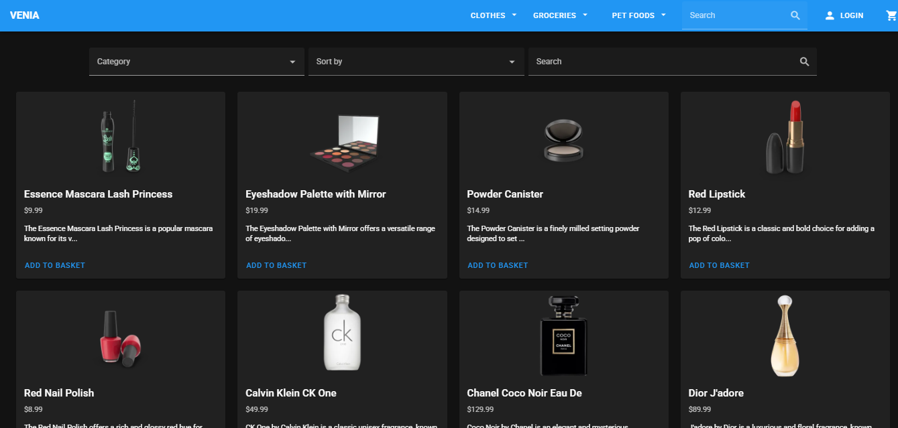
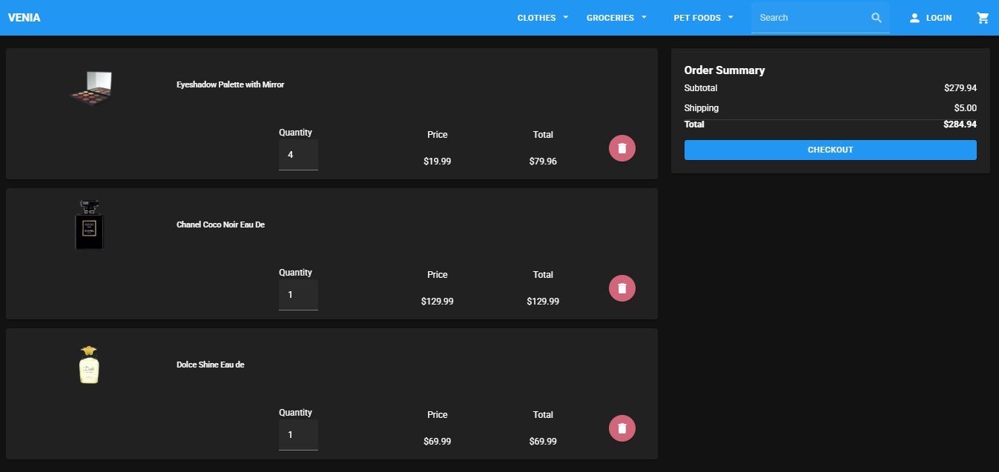

# 🛒 Vue Product Page – Interview Task

A Vue 3 + Vuetify 3 e-commerce product page with dynamic filtering, sorting, and a basket system built as part of an interview task.

## 🔗 Live Demo
[Click to View](https://your-vercel-link.vercel.app)

## 📦 GitHub Repository
[GitHub Repo](https://github.com/yourusername/vue-product-page)

---

## 🧰 Tech Stack

- **Vue 3** (Composition API + `<script setup>`)
- **Vuetify 3** (Material Design UI framework)
- **Vuex** (State management)
- **Vite** (Build tool for fast dev)
- **LocalStorage** (Basket state persistence)

---

## ✨ Features

- 🛍️ Product listing from [dummyjson.com/products](https://dummyjson.com/products)
- 🔍 Search, category filtering, and sorting by name/price
- 🧾 Product detail modal with add-to-basket functionality
- 🧺 Basket page with product image, quantity, price, and total
- 📦 Order summary card: subtotal, shipping, total, and checkout
- 🗂️ Modular Vuex store with persistence using `localStorage`
- ✅ Responsive, clean design using Vuetify
- ⚠️ Error handling and edge case management
- 🚀 Hosted on Vercel for easy access

---

## 📸 Screenshots

## 📦 Product Listing

  

## 🛒 Basket Page

